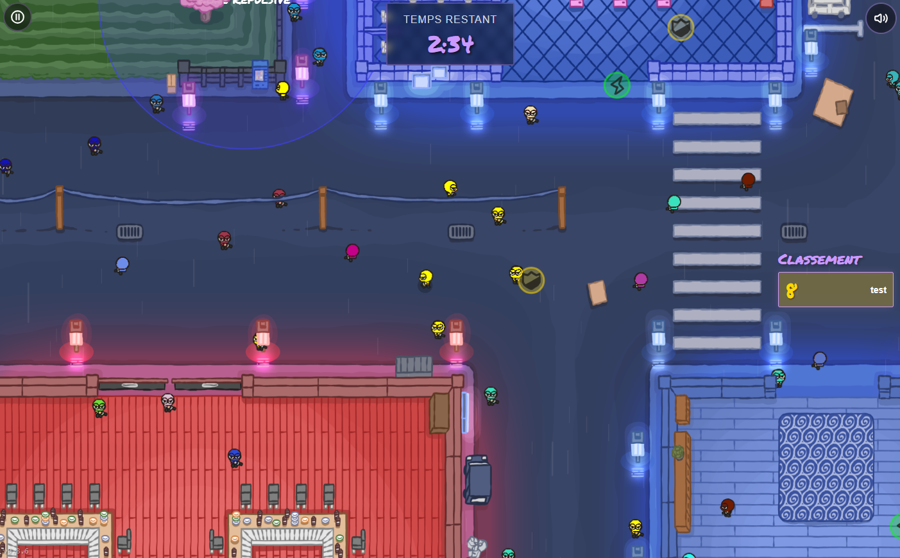

# Neon Ninja (WIP)

**Neon Ninja** is a small multiplayer web game prototype built entirely as a learning project.

## 🎮 Concept

In *Neon Ninja*, players take control of a randomly colored ninja and must blend in among a crowd of color-matching bots.  
The goal: capture as many bots as possible — without getting caught by other players doing the same.

Each time a player touches a bot, the bot is "converted" and starts matching the player's color, scoring 1 point.  
But beware: if another player catches you, they’ll steal *all* your captured bots — and you’ll respawn with a new color.  
The game also features **power-ups and power-downs** to spice up the gameplay, and the host can tweak many game parameters before starting.

## 🛠️ Technologies

- Node.js
- WebSockets (native)
- HTML/CSS/JavaScript (vanilla)
- Hosting: [Render](https://render.com)

## 👶 Why this project?

This is my very first attempt at building a multiplayer game, and I started with **no prior experience** in game development.

I used Claude AI as a coding assistant to help me design and build the mechanics step by step. It worked — the game is playable — but the code quickly became messy due to my inexperience and the trial-and-error nature of development.  
Maintaining or adding new features is now challenging without a proper refactor.

I'm sharing the code publicly:
- As a **learning archive** for others starting out with similar ambitions.
- In case anyone wants to contribute, **refactor the code**, or help turn this into a more polished prototype.

## 💡 Future ideas (not yet implemented)

- Bigger, scrollable maps
- Multiple game modes
- More power-ups and advanced game modifiers
- Improved UI/UX and responsive design
- Gamepad support (why not!)

## ⚠️ Status

Currently inactive — I haven't had time to work on this in several months, but I still have many ideas for the future.  
If you'd like to help or fork it, feel free!

## 🙏 Credits

- **Bribz**: Asset creation (characters, maps)
- **Flo**: Interface mockups

---

**Demo (free hosting on Render):** _(https://to-the-point.onrender.com/)_  
**Author:** [Dendrolag](https://github.com/Dendrolag)
